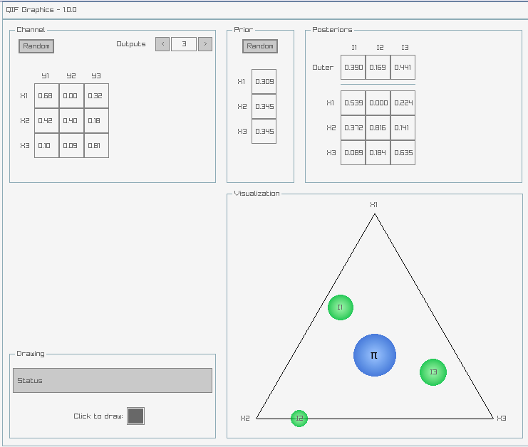

# QIF Graphics
Graphical tool for representing the Quantitative Information Flow (QIF) among a set of three secrets.
Developed in C/C++ all the graphic structures were made using [raylib](https://raylib.com) library and [emscripten](https://emscripten.org) to compile the project do .js and WebAssembly.

The tool is in version 1.0.1 and is available at https://homepages.dcc.ufmg.br/~ramon.gonze.

# References
[[1]](https://www.springer.com/us/book/9783319961293) Alvim M.S; Chatzikokolakis K; McIver A; Morgan C; Palamidessi C; Smith G.S. **The Science of Quantitative Information Flow**. Springer, 1 edition, 2019.

[[2]](https://raylib.com) Raylib. A simple and easy-to-use library to enjoy videogames programming. Available at https://raylib.com. Accessed in 01/18/2019.

[[3]](https://emscripten.org) Emscripten. A toolchain for compiling to asm.js and WebAssembly, built using LLVM, that lets you run C and C++ on the web at near-native speed without plugins. Available at https://emscripten.org. Accessed in 01/18/2019.
